  

  

  

---

## 👨‍💻 About Me

I'm a developer who treats code as a problem-solving tool.

As a student, I'm passionate about finding the right tech for the job—whether it's Python for an AI-powered tool or React for a slick, user-centric web app.

I'm constantly exploring, building, and shipping scalable, impactful solutions.

## 🤝 Let's Connect!

  
  
  

---

## 🛠️ My Toolkit

  

---

## 📦 Project Portfolio

A selection of my key projects and open source contributions:

| Project | Description | Tech Stack |
|---------|-------------|------------|
| [NewsHunt-bot](https://github.com/erzer12/NewsHunt-bot) | Automated bot for collecting and sharing the latest news articles | Python |
| [Portfolio](https://github.com/erzer12/Portfolio) | Personal developer portfolio site | TypeScript, CSS |
| [HireMind](https://github.com/erzer12/HireMind) | Job search & HR assistant platform | JavaScript, CSS, HTML |
| [festive-js](https://github.com/inovus-labs/festive-js) | Festive overlays for websites (contributor) | JavaScript, HTML, Shell |
| [Nasa-hacthon](https://github.com/erzer12/Nasa-hacthon) | NASA Hackathon project | Python, JavaScript, TypeScript |
| [mulearnhome](https://github.com/gtech-mulearn/mulearnhome) | μLearn community home (contributor) | TypeScript |
| [hr-agent](https://github.com/erzer12/hr-agent) | AI bot for resume screening, candidate ranking, and interview scheduling. | Python, TypeScript |

---

## 📊 GitHub Landscape

  <table width="100%">
    <tr align="center">
      <td width="50%">
        
      </td>
      <td width="50%">
        
      </td>
    </tr>
    <tr align="center">
      <td colspan="2">  
      </td>
    </tr>
  </table>

   

  
  

---

## 📚 Learning Roadmap
- 🔥 **Next:** Completing "Templates for Website Design" (HTML/CSS/JS)
- 🌍 **Exploring:** Backend dev for "Music App" (Django/Node.js)
- 👁️ **Experimenting:** Computer Vision (OpenCV, TensorFlow)
- 🤖 **New:** Prompt engineering for AI models
- 🌐 **Contributing:** Actively involved in open source

---

  
🥚 Fun Fact

   
  That 'calming cat' gif? That's basically my internal reaction every time my code runs without an error on the first try.

  
🤖 Secret Protocol

   
  

---

  

